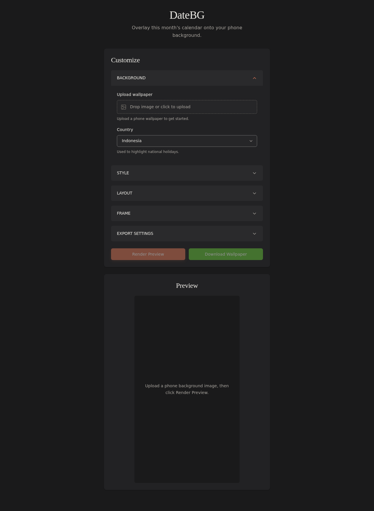

# DateBG

DateBG is a vibe coded web application that overlays the current month's calendar onto your phone background image. It fetches national holidays for your selected country and displays them on the calendar, creating a personalized wallpaper with practical date reference.


*Above: Final calendar wallpaper with Indonesian holidays rendered on a nature background*

## App Interface



*Above: DateBG web application interface for customizing calendar overlay*

## Features

- **Vibe Coded**: Built iteratively with AI assistance
- **Self-Hosted**: Requires a running server, designed for personal deployment
- **Custom Calendar Overlay**: Renders the current month's calendar on any background image
- **Holiday Integration**: Automatically fetches and displays national holidays via the [Nager.Date API](https://date.nager.at/api)
- **iOS Shortcuts Integration**: Designed to work with the iOS Shortcuts app for automatic daily wallpaper refresh (see [iOS Shortcuts Usage](#ios-shortcuts-usage) below)
- **Font Customization**: Choose from 40+ curated font combinations (serif, sans-serif, monospace)
- **Layout Controls**: Adjust calendar width, height, and vertical position
- **Frame Styling**: Optional semi-transparent frame with customizable color, opacity, and border
- **Text Effects**: Text outline with optional auto-contrast for better visibility
- **Timezone Aware**: Displays the correct date based on your timezone
- **Export Settings**: Share your configuration via URL parameters

## Prerequisites

- **Node.js** v18+ (recommended: v20+)
- **npm** v9+
- **Docker** (optional, for containerized development/production)

## Quick Start

### Option 1: Local Development (Recommended)

1. **Install dependencies**:
   ```bash
   npm install
   ```

2. **Start the development server** (runs both Vite frontend and Express backend):
   ```bash
   npm run dev
   ```

3. **Open your browser**:
   - Frontend: http://localhost:5173
   - Backend API: http://localhost:3000

### Option 2: Docker Development

```bash
docker compose up dev
```

Access the app at http://localhost:5173

### Option 3: Docker Production

```bash
# Build the production image
docker compose build prod

# Run the production container
docker compose up prod
```

Access the app at http://localhost:3000

## Available Scripts

| Command | Description |
|---------|-------------|
| `npm run dev` | Start development server with hot-reload (frontend + backend) |
| `npm run build` | Build production bundle |
| `npm start` | Start production server (requires build first) |
| `npm run preview` | Build and start production server |

## API Endpoints

The backend server provides the following endpoints:

### `GET /api/health`
Health check endpoint.

### `GET /api/available-countries`
Returns list of countries supported for holiday data.

### `GET /api/holidays?country={code}&year={year}`
Returns public holidays for a specific country and year.

### `POST /api/render`
Renders a calendar overlay on an uploaded image.

**Headers:**
- `X-API-Key` - Your API key (required if `API_KEY` is configured on server)

**Query Parameters:**
- `country` - Country code for holidays (e.g., `US`, `ID`, `GB`)
- `font` - Font family (e.g., `'Inter', sans-serif`)
- `fontScale` - Font size percentage (50-150)
- `calendarWidth` - Calendar width percentage (50-100)
- `calendarHeight` - Calendar height percentage (20-50)
- `calendarY` - Vertical position percentage (0-100)
- `framePadding` - Frame spacing (0-15)
- `showFrame` - Show/hide frame (`true`/`false`)
- `frameOpacity` - Frame opacity (0-100)
- `frameColor` - Frame color (hex)
- `frameBorder` - Show/hide frame border (`true`/`false`)
- `textOutline` - Enable text outline (`true`/`false`)
- `textOutlineAutoContrast` - Auto-contrast outline (`true`/`false`)
- `timeZone` - Timezone for current date

**Request Body:** Raw image buffer (PNG, JPEG, etc.)

**Response:** Rendered PNG image

## iOS Shortcuts Usage

DateBG was originally built to be used alongside the iOS Shortcuts app for automatic daily wallpaper updates. You can create a shortcut that:

1. Fetches a background image (from Photos, Files, or a URL)
2. Sends it to the DateBG server's `/api/render` endpoint
3. Saves the returned image to your Photos library
4. Optionally sets it as your wallpaper

This allows your lock screen or home screen to automatically display a fresh calendar wallpaper every day without manual intervention.

### Example Shortcut Flow

```
1. Get image from Photos/Files
2. Make POST request to: http://your-server:3000/api/render?country=US&font=Inter
   - Headers: X-API-Key: your-secret-api-key
3. Save response to Photos
4. (Optional) Set as wallpaper
```

### iOS Shortcuts Setup

1. Open the **Shortcuts** app on your iPhone/iPad
2. Create a new shortcut with these actions:
   - **Get Image** → Select from Photos or Get from Files
   - **Dictionary** → Create headers:
     - Key: `X-API-Key`, Value: `your-secret-api-key`
     - Key: `Content-Type`, Value: `image/png`
   - **Request** → 
     - URL: `https://your-domain.com/api/render?country=US&font=Inter`
     - Method: `POST`
     - Headers: (from Dictionary)
     - Body: (Image from step 1)
   - **Save to Photo Album** → Save the response image
   - **Set Wallpaper** → (Optional)

### API Key in Shortcuts

- The API key is stored **inside the Shortcut** configuration
- Each person using the Shortcut must enter their own API key
- You can store the key in **iCloud Key-Value Store** for easier management

For remote access, deploy the server to a cloud provider and use the public URL in your shortcut.

## Programmatic Usage

You can render calendar overlays programmatically:

```bash
curl -X POST "http://localhost:3000/api/render?country=US&font=Inter&fontScale=100" \
  -H "Content-Type: image/png" \
  --data-binary @background.png \
  -o calendar-wallpaper.png
```

## Project Structure

```
DateBG/
├── src/                    # Frontend React source
│   ├── App.jsx            # Main application component
│   ├── main.jsx           # React entry point
│   └── styles/            # CSS stylesheets
├── server/                # Backend Express server
│   ├── index.js          # Main server file
│   ├── renderCalendar.js # Calendar rendering logic
│   ├── registerFonts.js  # Font registration
│   └── fonts/            # Custom font files
├── docker-compose.yml     # Docker Compose configuration
├── Dockerfile            # Production Docker image
├── Dockerfile.dev        # Development Docker image
├── package.json          # Dependencies and scripts
└── vite.config.js        # Vite configuration
```

## Technology Stack

- **Frontend**: React 18, Vite
- **Backend**: Express.js, Node.js
- **Rendering**: Skia-Canvas (for image manipulation)
- **Fonts**: @fontsource packages (Google Fonts)
- **API**: Nager.Date API for holiday data
- **Containerization**: Docker, Docker Compose

## Self-Hosting Guide

DateBG is designed for self-hosting. Here's everything you need to deploy and run your own instance.

### Production Deployment with Docker (Recommended)

1. **Build the production image**:
   ```bash
   docker compose build prod
   ```

2. **Run the production container**:
   ```bash
   docker compose up -d prod
   ```

3. **Access the app** at http://localhost:3000

### Production docker-compose.yml Example

For a production-ready deployment, create a `docker-compose.prod.yml`:

```yaml
services:
  datebg:
    image: datebg:prod
    build:
      context: .
      dockerfile: Dockerfile
    container_name: datebg
    restart: unless-stopped
    ports:
      - "3000:3000"
    environment:
      - NODE_ENV=production
      - PORT=3000
    healthcheck:
      test: ["CMD", "curl", "-f", "http://localhost:3000/api/health"]
      interval: 30s
      timeout: 10s
      retries: 3
```

### Environment Variables

| Variable | Default | Description |
|----------|---------|-------------|
| `PORT` | 3000 | Server port |
| `NODE_ENV` | development | Environment mode |
| `ALLOWED_ORIGINS` | (none) | Comma-separated list of allowed web origins (e.g., `https://yourdomain.com`) |

### Deployment Options

#### Cloud Platforms

DateBG can be deployed to any Node.js-compatible hosting platform:

- **Railway**: Push to GitHub, connect Railway, deploy automatically
- **Render**: Create a Web Service from your Git repo
- **Fly.io**: Use `flyctl launch` and `flyctl deploy`
- **Heroku**: Push to Git remote, auto-deploys
- **DigitalOcean App Platform**: Connect GitHub repo, configure build command

#### Self-Hosted Options

- **Raspberry Pi**: Run with Docker on a Pi 4+ for a low-power home server
- **Home Server**: Deploy on any Linux/Windows/Mac machine with Docker
- **VPS**: Deploy to a virtual private server (Linode, DigitalOcean, Vultr, Hetzner)

### Remote Access Setup

For iOS Shortcuts integration with remote access:

1. **Deploy to a cloud provider** with a public URL, or

2. **Expose your local server** using:
   - **ngrok**: `ngrok http 3000`
   - **Cloudflare Tunnel**: Free secure tunneling
   - **LocalTunnel**: Open-source alternative

3. **Configure your router** for port forwarding (if self-hosting at home):
   - Forward external port 3000 to your server's internal IP
   - Set up Dynamic DNS if you don't have a static IP

4. **Set up HTTPS** (recommended for production):
   - Use a reverse proxy like **Caddy** or **Nginx** with **Let's Encrypt**
   - Many cloud providers offer automatic HTTPS
   - For home setups, consider **Cloudflare Tunnel** which provides HTTPS

### Firewall Configuration

Ensure the following ports are accessible:

- **Port 3000** (or your configured `PORT`): Main application port

For remote access, you may need to:
- Open port 3000 in your server's firewall
- Configure security groups (AWS, GCP, Azure)
- Set up ufw/iptables rules on Linux

### Example: Deploy to Railway

1. Push your code to GitHub
2. Go to [railway.app](https://railway.app)
3. Click "New Project" → "Deploy from GitHub"
4. Select your DateBG repository
5. Railway will auto-detect the Node.js project and deploy
6. Get your public URL from Railway dashboard
7. Use this URL in your iOS Shortcuts

### Example: Deploy to Fly.io

```bash
# Install flyctl and login
flyctl auth login

# Launch and deploy
flyctl launch
flyctl deploy

# Get your app URL
flyctl status
```

### Security Considerations

> **⚠️ Important**: When deploying DateBG publicly, you should enable API key authentication to prevent unauthorized usage.

#### API Key Authentication

DateBG now includes built-in API key authentication:

1. **Generate a secure API key**:
   ```bash
   openssl rand -base64 32
   # Example output: 7Xk9pL2mN5qR8tUwY3zA6bC1dE4fG7hJ0iK...
   ```

2. **Configure your deployment**:
   ```bash
   # Copy .env.example to .env
   cp .env.example .env
   
   # Edit .env and add your API_KEY
   ```

3. **Update docker-compose.yml**:
   ```yaml
   environment:
     - API_KEY=your-secret-api-key
   ```

4. **Frontend**: Enter your API key in the web interface (stored in localStorage)

5. **iOS Shortcuts**: Add `X-API-Key` header to your requests

#### Rate Limiting Protection

The server includes built-in rate limiting:
- **Failed auth attempts**: 10 per 15 minutes per IP
- **General API requests**: 100 per 15 minutes per IP

#### Cloudflare Protection (Recommended)

When using Cloudflare Tunnel for remote access:

1. **Enable WAF (Web Application Firewall)** - Free tier includes:
   - SQL injection protection
   - XSS protection
   - Known bad bots blocking

2. **Enable Bot Fight Mode** - Detects and blocks automated attacks

3. **Rate Limiting Rules** - Add custom rules:
   - Block IPs making >100 requests/minute
   - Challenge suspicious traffic

4. **IP Access Rules** - Optionally whitelist only your IPs

#### Additional Security Measures

- **CORS Configuration**: Set `ALLOWED_ORIGINS` to restrict which domains can access the API
- **HTTPS**: Always use HTTPS (Cloudflare provides this automatically)
- **Monitoring**: Check server logs for suspicious activity
- **Strong Keys**: Use 32+ character random API keys

### Protecting Your Deployment

Additional options to restrict access:

1. **Private URL**: Keep your server URL secret (security through obscurity)
2. **IP Whitelisting**: Restrict access to known IPs via firewall rules
3. **Cloud Provider Auth**: Use built-in auth from Railway, Render, etc.
4. **Network-Level Auth**: Use Cloudflare Access or similar zero-trust solutions

### Monitoring & Maintenance

- **Logs**: `docker logs datebg` or check your cloud provider's logging
- **Health Check**: Monitor `GET /api/health` endpoint
- **Updates**: Pull latest code, rebuild, and restart
- **Backups**: Save your custom configurations and settings

## License

Private project (see `package.json`)